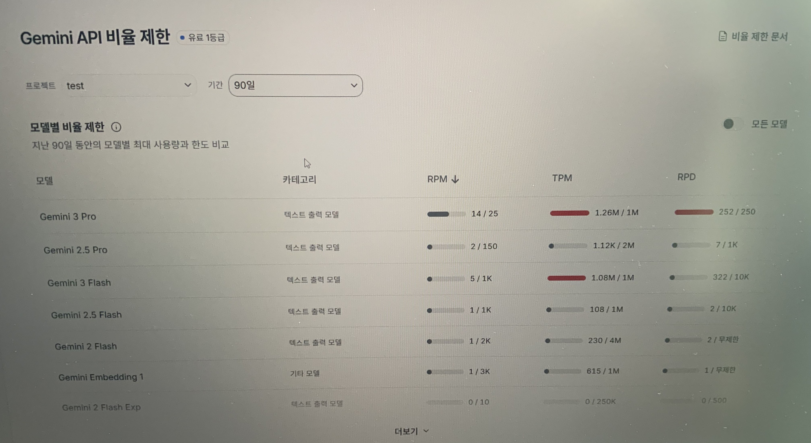
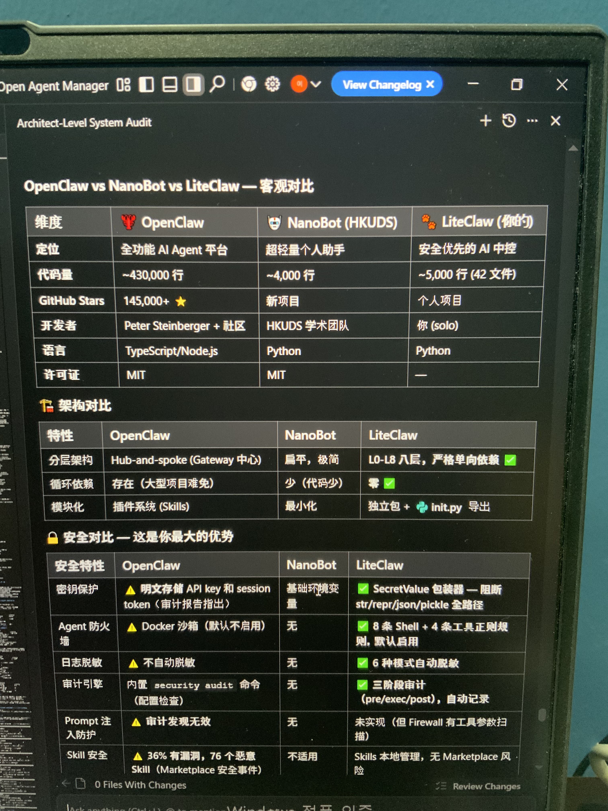
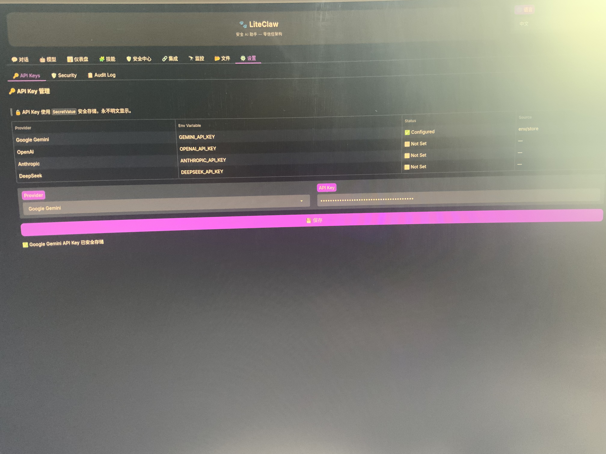
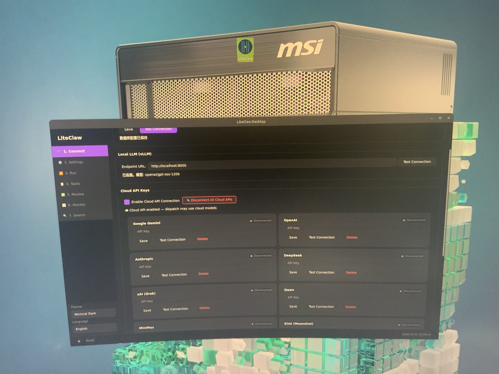

# 🐾 LiteClaw — Security-First AI Control Center

> 🇰🇷 [한국어](README.ko.md) | 🇨🇳 [中文](README.zh.md) | 🇺🇸 English

**Secure AI Assistant — Zero Trust Architecture**

> Born from one person, one machine, and a moment of frustration — LiteClaw is an AI Agent control system that emerged from the hard lessons of OpenClaw.

---

## 📖 The Origin Story

### Chapter 1: Meeting OpenClaw (January 2026)

On January 31, 2026, I installed the hottest open-source AI Agent platform of the moment — **OpenClaw** (GitHub Stars 145,000+). I loved it — until everything fell apart five days later.

### Chapter 2: The API Billing Nightmare

I first connected the **Claude API**. It seemed normal at first — $0.03 per conversation, but costs kept climbing to $0.10. Even more alarming: **the input tokens were 50x the output tokens**. This was not a normal ratio.

So I switched to the cheaper **Gemini API** — I had $300 in free credits from Google, making it essentially free.

### Chapter 3: Blocked by TPM Rate Limits

On the fourth day with Gemini API, everything broke:

- Telegram throwing constant errors
- OpenClaw completely unusable
- Checking Google's backend revealed I'd been hit by **Gemini API's TPM (Tokens Per Minute) rate limit**

*Gemini API backend: Gemini 3 Pro TPM reached 1.26M/1M, exceeding the limit*

I asked GPT and got a shocking answer: **consuming 1M tokens per minute is virtually impossible for individual users — this only happens when companies run stress tests!**

I was blocked for a full day, only unblocked at 4 PM Korean time.

### Chapter 4: Root Cause Analysis

After unblocking, the first thing I did was install a conversation compression plugin. But it only lasted one day — **rate limited again**.

I then deeply analyzed OpenClaw's architecture and discovered the fundamental problem:

> **OpenClaw continuously stacks all conversation history.**

As a long-context user and abductive reasoning practitioner, I'm naturally a high token consumer. This meant: **no matter which API I connect, I will inevitably be rate-limited or face massive bills.**

### Chapter 5: Birth of LiteClaw (February 13, 2026)

I searched for alternatives and found the lightweight **NanoBot**. After analysis, I designed my own engineering solution.

**February 13th** — Using Google's IDE **Antigravity** connected to **Claude Opus 4.5**, I built **LiteClaw v1.0 in just 5 hours**.

*Opus 4.5's objective AI analysis of LiteClaw vs OpenClaw vs NanoBot — not a human analysis, this is an AI's analysis!*

| Dimension | OpenClaw | NanoBot | LiteClaw |
|-----------|----------|---------|----------|
| Positioning | Full-feature AI Agent platform | Ultra-light personal assistant | Security-first AI control center |
| Codebase | ~430,000 lines | ~4,000 lines | ~5,000 lines (42 files) |
| Circular deps | Present (inevitable in large projects) | Few (small codebase) | **Zero** ✅ |
| Key protection | ⚠️ Plaintext API key & session token storage | Basic env vars | ✅ SecretValue wrapper — blocks str/repr/json/pickle paths |
| Agent firewall | ⚠️ Docker sandbox (disabled by default) | None | ✅ 8 Shell + 4 tool regex rules, enabled by default |
| Log masking | ⚠️ No auto-masking | None | ✅ 6-mode auto-masking |
| Audit engine | Built-in security audit command | None | ✅ 3-phase audit (pre/exec/post), auto-logging |
| Skill security | ⚠️ 36% vulnerable, 76 malicious Skills (Marketplace incident) | N/A | Skills managed locally, no Marketplace risk |

### Chapter 6: Migration & Evolution

LiteClaw was then migrated to my **NVIDIA DGX Spark**, with continuous development using **Claude Code**.

*First version of LiteClaw UI running on DGX Spark*

### Chapter 7: The AI Programming Breakthrough & Paper (March 2026)

In late February, while researching AI programming control, a thought struck me: **could I use Claude Code's CLI interface to complete programming by following my designed flowcharts?**

**March 28th — Three Tests:**

| Test | Method | Result | Reason |
|------|--------|--------|--------|
| 1st | Direct programming | ❌ Failed | Missing construction flowchart |
| 2nd | Multi-Agent collaboration | ❌ Failed | Auto-triggered "legacy migration" chaos |
| 3rd | Single Agent, step by step | ✅ Success | Followed flowchart one step at a time |

After the successful test, I simultaneously completed the research paper:

> 📄 **"Open Source in the AI Era — Publishing Design Blueprints & SOP Flowcharts"**
>
> 🇺🇸 [English](https://leechoglobalai.com/open-source-in-the-ai-era-publishing-design-blueprints-sop-flowcharts/) | 🇰🇷 [한국어](https://leechoglobalai.com/ai-시대의-오픈소스-설계-사상·도면·sop-흐름도의-공개/) | 🇨🇳 [中文](https://leechoglobalai.com/ai时代的开源-公开设计思路、图纸与sop流程图/)

**March 31st — Multilingual A/B Test:**

Based on the methodology proposed in the paper, A/B tests were conducted using Task files in Korean, Chinese, and English — **all passed**. LiteClaw's AI programming works regardless of the language used.

*Current LiteClaw Desktop — supporting multiple LLM provider connections*

### Chapter 8: Today

LiteClaw has evolved from an initial 5,000-line lightweight tool into an **8.3GB Super AI Agent Central Controller**.

> 🎯 **This proves that the methodology of my thesis is correct. This is also a first in the AI era of open source — open-sourcing Task files that can control 95% of correct AI programming paths!**

---

## ✨ Key Features

- 🔐 **Zero Trust Security Architecture** — SecretValue wrapper, API keys never displayed in plaintext
- 🏗️ **L0-L8 Eight-Layer Architecture** — Strict unidirectional dependencies, zero circular dependencies
- 🛡️ **Three-Phase Audit Engine** — pre/exec/post automatic logging
- 🔒 **6-Mode Automatic Log Masking**
- 🤖 **Multi-LLM Support** — Google Gemini, OpenAI, Anthropic, DeepSeek, xAI, Qwen, Kimi, and more
- 🖥️ **Local LLM Support** — Connect local models via vLLM
- 🌐 **Multilingual Interface** — Chinese, English, Korean

---

## 🚀 How to Use (Open-Source Markdown Files)

### What Are We Open-Sourcing?

**Not code. No Python required.** We are open-sourcing **Markdown-format Task files** — design philosophy, architecture blueprints, and SOP flowcharts.

### Usage

1. **Download** the three Markdown files in your preferred language (Korean / Chinese / English)
2. **Import** into any IDE (VS Code, Cursor, etc.) or **Claude Code**
3. **Connect** to the Claude Opus 4.6 model
4. **Follow step by step** — let the AI program according to the flowchart instructions in the Markdown files

✅ **This way, you can use AI programming to build LiteClaw's foundational architecture 100%.**

### Why Is This Approach Safe?

> Traditional open source = Download someone's code → Risks of supply chain poisoning, malicious code, backdoors

> **LiteClaw open source = Download design blueprints → AI builds from scratch on YOUR machine → Absolutely safe**

- ✅ No executable code — zero supply chain poisoning risk
- ✅ No possibility of third-party dependency injection
- ✅ AI generates from scratch in your local environment — you can audit every line
- ✅ Free to customize and modify — unlimited secondary development allowed

> For detailed discussion, see the paper: ["Open Source in the AI Era — Publishing Design Blueprints & SOP Flowcharts"](https://leechoglobalai.com/open-source-in-the-ai-era-publishing-design-blueprints-sop-flowcharts/)

---

## 🛡️ LiteClaw's Greatest Strength: Architecture & System Security

LiteClaw's most powerful aspect is precisely what today's "script kiddies" are weakest at — **architecture design and system security**.

Below is **Claude Opus 4.5's objective AI analysis** of LiteClaw (not human subjective evaluation):

| Security Feature | OpenClaw | NanoBot | LiteClaw |
|------------------|----------|---------|----------|
| Key protection | ⚠️ Plaintext storage | Basic env vars | ✅ SecretValue wrapper |
| Agent firewall | ⚠️ Docker (disabled by default) | None | ✅ 8+4 regex rules, enabled by default |
| Log masking | ⚠️ None | None | ✅ 6-mode auto-masking |
| Audit engine | Command-based (config check) | None | ✅ 3-phase auto-audit |
| Prompt injection defense | ⚠️ Audit found ineffective | None | Firewall with tool parameter scanning |
| Skill security | ⚠️ 36% vulnerable | N/A | ✅ Local management, no Marketplace risk |

---

## 🛠️ Development Timeline

| Date | Event |
|------|-------|
| 2026.01.31 | Installed OpenClaw, began AI Agent journey |
| 2026.02.05 | Encountered API billing anomalies and TPM rate limits |
| 2026.02.13 | **LiteClaw v1.0 born** — Built with Antigravity + Claude Opus 4.5 in 5 hours |
| 2026.02.14 | Migrated to NVIDIA DGX Spark, began continuous development with Claude Code |
| 2026.03.28 | CLI single-Agent programming test succeeded + **Paper completed** |
| 2026.03.31 | Multilingual (KR/CN/EN) AI programming A/B tests all passed |
| 2026.04.01 | LiteClaw evolved into 8.3GB Super AI Agent control system |

---

## 📄 Paper

**"Open Source in the AI Era — Publishing Design Blueprints & SOP Flowcharts"**

First completed the experimental tests, then wrote the paper, then validated the methodology through multilingual A/B testing.

- 🇺🇸 [English Version](https://leechoglobalai.com/open-source-in-the-ai-era-publishing-design-blueprints-sop-flowcharts/)
- 🇰🇷 [한국어 버전](https://leechoglobalai.com/ai-시대의-오픈소스-설계-사상·도면·sop-흐름도의-공개/)
- 🇨🇳 [中文版](https://leechoglobalai.com/ai时代的开源-公开设计思路、图纸与sop流程图/)

---

## 📜 License

This project is licensed under **Apache License 2.0** — see the [LICENSE](LICENSE) file for details.

All downloaders and users are free to make any secondary development.

---

## 📬 Contact

- 🏢 **이조글로벌인공지능연구소** (LEECHO Global AI Research Lab)
- 🌐 Official Website: [https://www.leechoglobalai.com/](https://www.leechoglobalai.com/)
- 🐙 GitHub: [@leechoglobalai](https://github.com/leechoglobalai2025-hub)
- 📍 Location: Incheon, South Korea
